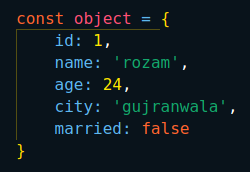
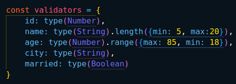

# Immutify

Immutify is an open-source JavaScript project designed to provide an easy-to-use API for mutating objects with customizable validations.

# How to run the project?

### Step 1: Install Dependencies
Use either npm or yarn to install the necessary dependencies:

npm install 
OR
yarn install

### Step 2: Start the Development Server
Run the following command to start the development server:

npm run dev
OR
yarn dev

# How to Use the API

## Example
Here's a step-by-step example of how to use Immutify to validate and mutate objects.

### Step 1: Create an Object
Define your JavaScript object:

### Step 2: Import the type Function
Import the type function from Immutify:
import { type } from 'immutify';

Create a validation schema:

### Step 3: Import the validate Function
Import the validate function from Immutify:
import { validate } from 'immutify';

const proxy = validate(object, validators);

### Step 4: Mutate the Object

proxy.age = 50;  // Valid change

proxy.age = 10;  // Throws an error (age must be between 18 and 85)

